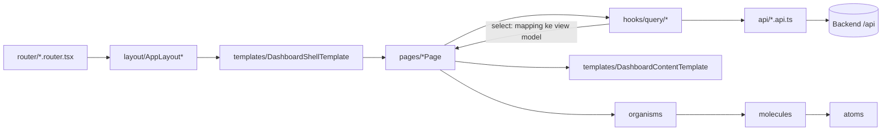

# Arsitektur Frontend Qosmo (Atomic Design)

Dokumen ini menjelaskan struktur frontend **yang sudah dimigrasi** ke pola Atomic Design, yaitu semua kode di `src/app/`. Kode lama di `src/modules/*` masih memakai struktur per-modul dan belum mengikuti aturan di sini (lihat [Status Migrasi](#10-status-migrasi)).

Referensi: [Atomic Design, Chapter 2, Brad Frost](https://atomicdesign.bradfrost.com/chapter-2/).

---

## Daftar Isi

1. [Gambaran Umum](#1-gambaran-umum)
2. [Struktur Folder](#2-struktur-folder)
3. [Alur Data](#3-alur-data)
4. [Router & Layout](#4-router--layout)
5. [Komponen (Atomic Design)](#5-komponen-atomic-design)
6. [API](#6-api)
7. [Hooks](#7-hooks)
8. [Types](#8-types)
9. [Utils & Config](#9-utils--config)
10. [Status Migrasi](#10-status-migrasi)
11. [Auth](#11-auth)
12. [Panduan: Menambah Halaman Baru](#12-panduan-menambah-halaman-baru)
13. [Konvensi](#13-konvensi)

---

## 1. Gambaran Umum

| Hal | Teknologi |
|---|---|
| UI | React 19 + TypeScript, Vite |
| Styling | Tailwind CSS v4 |
| Routing | React Router v7 (`BrowserRouter` + `useRoutes`) |
| Data fetching | Axios (`apiRequest`) + TanStack Query v5 |
| Debounce/throttle | TanStack Pacer (`hooks/custom/pacer.ts`) |
| Chart | ECharts (`echarts-for-react`) |
| Map | Mapbox GL (`react-map-gl`) |
| Ikon | `react-icons/lu` (Lucide) |

Prinsip utama:

- **Komponen tidak memanggil API langsung.** API dipanggil lewat hook TanStack Query, lalu hasilnya dikirim ke komponen sebagai props.
- **Page merangkai, template mengatur tata letak, organism menampilkan.**
- **Response API dipetakan di hook** (`select`), jadi komponen menerima bentuk data yang siap pakai.

---

## 2. Struktur Folder

```
src/
├── main.tsx                     # entry: BrowserRouter + providers
├── plugins/router/index.tsx     # gabungkan semua router + pasang layout
└── app/
    ├── router/                  # definisi route per domain (*.router.tsx)
    ├── layout/                  # route layout: pilih template + menu sidebar
    ├── components/
    │   ├── atoms/               # elemen UI terkecil
    │   ├── molecules/           # gabungan atom, satu fungsi
    │   ├── organisms/           # bagian UI kompleks (tabel, panel, chart, nav)
    │   ├── templates/           # kerangka tata letak halaman
    │   ├── pages/               # halaman = template + data nyata
    │   └── App*/                # komponen lama (legacy), belum masuk atomic
    ├── api/                     # fungsi HTTP per domain + query keys
    ├── hooks/
    │   ├── query/               # hook TanStack Query per domain
    │   └── custom/              # hook UI/state umum
    ├── types/                   # tipe response API & view model per domain
    ├── utils/                   # fungsi murni (format, kalkulasi)
    └── config/                  # konstanta & opsi statis
```

---

## 3. Alur Data



Urutannya:

1. **Router** mencocokkan URL ke page (lazy import) dan membungkusnya dengan `AppRouteGuard`.
2. **Layout** (`src/app/layout`) memilih template shell (title bar + sidebar) dan daftar menu domain.
3. **Page** memegang state halaman (filter, pagination di URL), memanggil **query hook**, lalu mengirim data ke **organism** lewat props.
4. **Query hook** memanggil fungsi **api** dan memetakan response ke **view model** (`types`).

---

## 4. Router & Layout

### 4.1 Pendaftaran route

Semua router digabung di `src/plugins/router/index.tsx`. Route yang butuh login dibungkus `AuthRouteGuard requireAuth`, lalu dikelompokkan per **layout**:

| Layout (`src/app/layout`) | Template yang dipakai | Router | URL |
|---|---|---|---|
| `AppLayoutAuth` (tanpa login) | `AuthTemplate` | `auth.router.tsx` → `useAuthRouter` | `/login` |
| `AppLayoutAuth` (sudah login) | `AuthTemplate` | `auth.router.tsx` → `useAuthConfirmRouter` | `/confirm`, `/confirmasi` |
| `AppLayoutEmpty` | — (page memakai `LandingTemplate`) | `landing.router.tsx` | `/landing`, `/olo` |
| `AppLayoutFbb` | `DashboardShellTemplate` | `fbb.router.tsx` | `/fbb` → `/fbb/sla`, `/fbb/onx`, `/fbb/ookla` |
| `AppLayoutEbis` | `DashboardShellTemplate` | `ebis.router.tsx` | `/ebis` → `/ebis/kpi` |
| `AppLayoutFirstInsight` | `DashboardShellTemplate` | `first-insight.router.tsx` | `/first-insight` → `/first-insight/history-sla` |
| `AppLayoutProfile` | `DashboardShellTemplate` (tanpa menu) | modul profile | `/profile` |
| `AppLayoutDefault` | layout CNOP lama | `monday.router.tsx`, `rekonsiliasi.router.tsx`, modul lama | `/monday`, `/input-site`, dll. |

### 4.2 Format file router

```tsx
// src/app/router/fbb.router.tsx
const FbbOnxPage = lazy(() => import("@/app/components/pages/FbbOnxPage"));

const useFbbRouter = (): RouteObject[] => [
  { path: "fbb", element: <Navigate to="/fbb/sla" replace /> },
  {
    path: "fbb/onx",
    element: (
      <AppRouteGuard>
        <FbbOnxPage />
      </AppRouteGuard>
    ),
  },
];
```

Aturan:

- Satu file router per domain, dengan nama `use<Domain>Router`.
- Page selalu di-`lazy` import.
- Path induk domain (`/fbb`) diarahkan ke submenu pertama.

### 4.3 Layout vs Template

- **Layout** (`src/app/layout`) mengurus **routing**: membaca `location`, menentukan menu aktif dan judul, lalu merender `<AppRouteWrapper />` (outlet).
- **Template** (`components/templates`) mengurus **tampilan**: menerima `title`, `menus`, dan `children` tanpa tahu soal router.

```tsx
// src/app/layout/AppLayoutFbb/index.tsx
<DashboardShellTemplate menus={FBB_MENUS} activeKey={activeMenu.key} title={activeMenu.label}>
  <AppRouteWrapper />
</DashboardShellTemplate>
```

### 4.4 State di URL

Pagination dan mode tampilan disimpan di query string supaya tidak hilang saat refresh. Gunakan `useUrlSearchState` / `useUrlPagination` (lihat [7.2](#72-custom-hooks)).

| Halaman | Param |
|---|---|
| `/fbb/onx`, `/fbb/ookla` | `view=detail`, `page`, `per_page`, `detail_page`, `detail_per_page` |
| `/input-site` | `page`, `per_page` |
| `/first-insight/history-sla` | `page`, `per_page` |

Nilai default (halaman 1, jumlah baris default, Map View) tidak ditulis ke URL.

---

## 5. Komponen (Atomic Design)

### 5.1 Definisi & aturan per level

| Level | Definisi | Boleh | Tidak boleh |
|---|---|---|---|
| **Atoms** | Elemen UI terkecil yang tidak bisa dipecah lagi | Props & styling | Import molecule ke atas, fetch data, router |
| **Molecules** | Gabungan beberapa atom dengan **satu fungsi** | Import atoms, state UI lokal (buka/tutup) | Import organism ke atas, fetch data, logika bisnis |
| **Organisms** | Bagian UI kompleks yang berdiri sendiri (tabel, panel, chart, navigasi) | Import atoms/molecules/organisms lain, logika tampilan | Import template/page |
| **Templates** | Kerangka tata letak; mengatur **struktur**, bukan isi | Import organisms ke bawah, slot `children`/props `ReactNode` | Fetch data, konten spesifik |
| **Pages** | Template yang diisi **data nyata** | Query hooks, state halaman, URL state | Styling layout berulang (pindahkan ke template) |

Arah import **hanya boleh ke level yang sama atau lebih rendah**:

```
pages → templates → organisms → molecules → atoms
```

### 5.2 Inventaris

**Atoms** (`components/atoms`, diekspor lewat `@/app/components/atoms`)

| Folder | Komponen |
|---|---|
| `alert` | `InlineAlert` (tone `warning` / `danger` / `info`) |
| `button` | `Button` (variant termasuk `gradient`, size sampai `xl`), `PillButton` |
| `checkbox` | `Checkbox` |
| `icon` | `Icon*` (wrapper ikon) |
| `input` | `TextInput`, `DateInput`, `TextAreaInput` |
| `label` | `FieldLabel`, `StatusPill`, `TableValue` |
| `popover` | `Popover` (primitive portal) |
| `skeleton` | `Skeleton` |
| `sparkline` | `Sparkline` |

**Molecules** (`components/molecules/<Nama>/index.tsx`)

| Komponen | Fungsi |
|---|---|
| `SectionCard` | Kartu section standar (border, radius 19px, shadow) |
| `DashboardToolbar` | Baris toolbar: slot filter kiri + aksi & avatar kanan |
| `KpiStatCard`, `KpiNotAchievedCard` | Kartu angka KPI |
| `SelectMenu` | Dropdown pilihan sederhana |
| `Select`, `FilterDropdown` | Dropdown berbasis `Popover` (bisa dicari) |
| `SearchInput` | Input + tombol clear + tombol cari |
| `Pagination` | Navigasi halaman + pilihan jumlah baris |
| `ColumnFilterPopover`, `ColumnSearchPopover` | Filter/cari per kolom tabel |
| `EmptyState`, `SampleDataBadge`, `NotchedCard` | Status & dekorasi |
| `FileDropzone` | Area unggah file |
| `IconInputField` | Label + input dengan ikon kiri + slot kanan (mis. toggle password) |
| `OtpInput` | Input kode OTP per digit (paste, backspace, panah) |
| `Modal` | Kerangka dialog generik (isi lewat `children`, `maskClosable` untuk mencegah tutup saat klik overlay) |

**Organisms** (`components/organisms/<kategori>/<Nama>`)

| Kategori | Komponen |
|---|---|
| `navigation` | `DashboardSidebar`, `ScallopedTitleBar` (header), `UserMenu` |
| `tables` | `FbbNationMetricsTable`, `FbbLoseRegionTable`, `FbbSlaIndicatorTable`, `HistorySlaAchievementTable`, `RekonsiliasiTable` |
| `panels` | `AccountPendingPanel`, `FbbOnxMapPanel`, `FbbSlaSummaryPanel`, `HistorySlaHighlightPanel`, panel Monday (`SlaPerformancePanel`, `TrendPerformancePanel`, dll.) |
| `charts` | `HistorySlaTrendChart` |
| `forms` | `FbbOnxFilterBar`, `RekonsiliasiFilterBar`, `LoginForm` |
| `popup` | `ImportTemplateModal`, `RekonsiliasiEditModal`, `TwoFactorModal` |

**Templates**

| Template | Dipakai oleh | Isi |
|---|---|---|
| `DashboardShellTemplate` | `AppLayoutFbb`, `AppLayoutEbis`, `AppLayoutFirstInsight`, `AppLayoutProfile` | Title bar + sidebar + area konten |
| `DashboardContentTemplate` | `FbbSlaPage`, `EbisKpiPage`, `FbbOnxPage`, `FbbOoklaPage`, `HistorySlaPage` | Toolbar + kartu konten utama (radius 36px) |
| `LandingTemplate` | `LandingPage`, `OloPage` | Header aksi + main + footer |
| `AuthTemplate` | `AppLayoutAuth` | Background login + kartu putih di tengah |
| `MondayTemplate`, `InputSiteTemplate` | `MondayPage`, `InputSitePage` | Kerangka halaman masing-masing |

`DashboardContentTemplate` punya dua posisi toolbar:

```tsx
// toolbar di atas kartu (FBB SLA, EBIS)
<DashboardContentTemplate toolbar={<DashboardToolbar … />}>…</DashboardContentTemplate>

// toolbar di dalam kartu (ONX, Ookla)
<DashboardContentTemplate toolbarPlacement="inside" toolbar={…}>…</DashboardContentTemplate>

// tanpa toolbar (History SLA)
<DashboardContentTemplate>…</DashboardContentTemplate>
```

**Pages**

| Page | URL | Sumber data |
|---|---|---|
| `LoginPage` | `/login` | `useLoginMutation` + `useTwoFactorFlow` |
| `AuthConfirmPage` | `/confirm`, `/confirmasi` | `useAuthUserDetailQuery`, `useLogoutMutation` |
| `LandingPage` | `/landing` | statis |
| `FbbSlaPage` | `/fbb/sla` | `useFbbSlaWsaQuery` |
| `FbbOnxPage` | `/fbb/onx` | `useFbb*Query` (ONX) |
| `FbbOoklaPage` | `/fbb/ookla` | `useFbbOokla*Query` |
| `EbisKpiPage` | `/ebis/kpi` | data contoh `api/ebis/ebisKpi.sample.ts` |
| `HistorySlaPage` | `/first-insight/history-sla` | `useHistorySla*Query` |
| `MondayPage` | `/monday` | query hook di dalam panel Monday |
| `InputSitePage` | `/input-site` | `useRekonsiliasiPeriod` + `useRekonsiliasiTable` |
| `OloPage` | `/olo` | coming soon |

### 5.3 Format komponen

```tsx
// named export untuk molecule/organism baru
interface KpiNotAchievedCardProps {
  label: string;
  value: number;
  loading?: boolean;
}

export function KpiNotAchievedCard({ label, value, loading = false }: KpiNotAchievedCardProps) {
  …
}
```

- Satu komponen per folder: `<Nama>/index.tsx`. Sub-komponen yang hanya dipakai di situ boleh ditaruh di folder yang sama (contoh: `MonitoringCtiPanel/CtiDetailContent.tsx`).
- Organism menerima data lewat props, termasuk status `loading` dan `error`.
- Page dan template memakai `export default`, karena di-`lazy` import atau dipakai sebagai kerangka.

---

## 6. API

### 6.1 Struktur

```
api/
├── base-url.ts            # apiClient (axios), apiRequest, serializeParams
├── index.ts               # re-export semua domain
└── <domain>/
    ├── <domain>.api.ts    # ENDPOINTS + fungsi get*/post*
    ├── query-keys.ts      # key TanStack Query
    ├── *.sample.ts        # (opsional) data contoh saat API belum ada
    └── index.ts
```

Domain yang ada: `auth`, `fbb`, `first-insight`, `monday-monitoring`, `reconsiliation`, `ebis` (sample).

### 6.2 `apiRequest`

- `baseURL` dari `VITE_APP_BASE_URL`, di-resolve oleh `resolveApiBaseUrl()`. Default `/api`, dan saat dev diarahkan lewat proxy.
- Token `access_token` dari `localStorage` otomatis dipasang di header `Authorization`.
- `serializeParams` membuang nilai kosong (`""`, `null`, `undefined`) dan menulis array sebagai `key[]=…`.
- **URL endpoint ditulis tanpa `/api`.**
- Error non-401 otomatis memunculkan `toast.error`. Status 401 menghapus sesi lalu redirect ke `/login`.
- Opsi per-request untuk mematikan perilaku otomatis:
  - `skipErrorToast: true`: halaman menampilkan pesan error sendiri.
  - `skipAuthRedirect: true`: 401 dianggap error biasa, dipakai untuk endpoint login/OTP.
- `getApiErrorMessage(error, fallback)` mengambil `response.data.message` dari backend, atau `fallback` kalau tidak ada.

### 6.3 Format fungsi API

```ts
// src/app/api/first-insight/historySla.api.ts
export const FIRST_INSIGHT_ENDPOINTS = {
  highlightSummary: "first-insight/highlight-summary",
  table: "first-insight/table",
} as const;

export const getHistorySlaTable = (
  { kpiCategory, search, page, perPage }: HistorySlaTableParams,
  signal?: AbortSignal,
) =>
  apiRequest<HistorySlaTableResponse>({
    method: "GET",
    url: FIRST_INSIGHT_ENDPOINTS.table,
    params: {
      ...(kpiCategory ? { kpi_category: kpiCategory } : {}),
      ...(search ? { search } : {}),
      page: page ?? 1,
      per_page: perPage ?? 10,
    },
    signal,
  });
```

Aturan:

- Parameter fungsi memakai **camelCase**. Konversi ke **snake_case** dilakukan di dalam fungsi.
- Selalu teruskan `signal` supaya request bisa dibatalkan oleh TanStack Query.
- Param opsional hanya dikirim kalau ada nilainya (`...(x ? { x } : {})`).

### 6.4 Query keys

```ts
export const firstInsightKeys = {
  all: ["first-insight"] as const,
  table: (params: Record<string, unknown>) => [...firstInsightKeys.all, "table", params] as const,
};
```

Key diawali nama domain, lalu nama resource, lalu params. Dengan begitu cache satu domain bisa di-invalidate sekaligus (`firstInsightKeys.all`).

---

## 7. Hooks

### 7.1 Query hooks (`hooks/query/<domain>`)

Tugasnya: memanggil API, mengatur cache, dan **memetakan response ke view model**.

```ts
export const useHistorySlaTableQuery = (params: HistorySlaTableParams) =>
  useQuery({
    queryKey: firstInsightKeys.table({ ...params }),
    staleTime: 5 * 60 * 1000,
    placeholderData: keepPreviousData,   // data lama tetap tampil saat ganti halaman
    queryFn: ({ signal }) => getHistorySlaTable(params, signal),
    select: (response): HistorySlaTableData => ({
      rows: response.data.map(toIndicator),
      categoryOptions: response.options?.kpi_category ?? [],
      meta: response.meta,
    }),
  });
```

Aturan:

- Nama hook: `use<Resource>Query`, atau `use<Resource>Mutation` untuk mutation.
- `staleTime`: data opsi/dropdown 30 menit, data dashboard 5 menit.
- Pakai `enabled` untuk query yang bergantung pada nilai lain (contoh: `enabled: Boolean(yearweek)`).
- Fungsi mapping (`toIndicator`, `toSharedRow`) ditaruh di file hook yang sama. Kalau dipakai di banyak tempat, pindahkan ke `utils`.

### 7.2 Custom hooks (`hooks/custom`)

| Hook | Kegunaan |
|---|---|
| `useUrlSearchState()` | Baca/tulis query string. `setParams({ key: value \| null })` aman dipanggil beberapa kali dalam satu event |
| `useUrlPagination({ defaultPerPage, pageKey?, perPageKey? })` | Pagination di URL: `{ page, perPage, setPagination, resetPage }` |
| `useDebouncedSearch(value)` | Debounce input pencarian (waktu tunggu dari `config/pacer.config.ts`) |
| `useThrottledEvent(fn)` | Throttle event (resize/scroll) |
| `useTwoFactorFlow({ open, pendingLogin, onSuccess })` | State machine 2FA: `EMAIL_OTP` → `SCAN_QR` / `AUTHENTICATOR`, serta reset via `EMAIL_RESET` |
| `useRekonsiliasiPeriod()` | State periode Rekonsiliasi (tahun/bulan/minggu) + `isSettled` |
| `useRekonsiliasiTable({ period })` | State tabel Rekonsiliasi (filter, search, pagination URL) |

> **Catatan `useUrlSearchState`:** `setSearchParams` bawaan React Router membaca param dari saat render. Kalau dipanggil dua kali dalam satu event, perubahan pertama hilang. `setParams` membaca `window.location.search` terbaru, jadi pakai hook ini, bukan `useSearchParams` langsung.

Contoh reset halaman saat filter berubah:

```ts
const pagination = useUrlPagination({ defaultPerPage: 10 });

const handleKpiCategoryChange = (value: string) => {
  setKpiCategory(value);
  pagination.resetPage();
};
```

### 7.3 Import

```ts
import { useHistorySlaTableQuery, useUrlPagination } from "@/app/hooks";
import { useDebouncedSearch } from "@/app/hooks/custom/pacer"; // pacer tidak diekspor dari index
```

---

## 8. Types

```
types/
├── fbb/              onx.types.ts, sla.types.ts
├── first-insight/    historySla.types.ts
├── monday/           *.types.ts
├── reconsiliation/   rekonsiliasi.types.ts
└── table.types.ts
```

Setiap domain punya dua jenis tipe:

| Jenis | Penamaan | Contoh | Dipakai di |
|---|---|---|---|
| **Response API** | `*Response`, `*Row`, `*Meta` (field **snake_case**, sama dengan backend) | `HistorySlaTableResponse`, `HistorySlaTableRow` | `api/*.api.ts`, input `select` di hook |
| **Params** | `*Params` (field **camelCase**) | `HistorySlaTableParams` | argumen fungsi API & hook |
| **View model** | nama domain (camelCase) | `HistorySlaIndicator`, `HistorySlaTrendPoint` | output `select`, props organism |

Organism sebaiknya menerima **view model**, bukan response mentah. Dengan begitu, perubahan bentuk response cukup diatasi di hook.

---

## 9. Utils & Config

- **`utils/*.utils.ts`**: fungsi murni tanpa React, misalnya `formatYearWeek`, `formatDecimal`, `summarizeAchievements`, `toInitials`.
- **`config/*.ts`**: konstanta & opsi statis, misalnya `PACER_WAIT`, `PARAMETER_OPTIONS`, dan menu CNOP (`menuConfig.ts`).
- Menu sidebar dashboard baru didefinisikan langsung di file layout-nya (`FBB_MENUS`, `EBIS_MENUS`, `FIRST_INSIGHT_MENUS`).

---

## 10. Status Migrasi

| Area | Status |
|---|---|
| `src/app/components/{atoms,molecules,organisms,templates,pages}` | ✅ Atomic |
| Auth (login, 2FA, konfirmasi akun) | ✅ Atomic, `src/modules/auth` sudah dihapus |
| Landing, FBB (SLA/ONX/Ookla), EBIS, First Insight, OLO | ✅ Atomic |
| Monday, Input Site (Rekonsiliasi) | ✅ Atomic, dengan catatan di bawah |
| `src/app/components/App*` (`AppTable`, `AppMenu`, `AppDropdown`, `AppInput`, `AppRadioGroup`) | ⏳ Legacy, masih dipakai modul lama |
| `src/app/components/AppRouterGuard`, `AppRouterWrapper` | Infrastruktur router (bukan UI atomic) |
| `src/modules/*` (dashboard, tutela, site, network, ticket, dll.) | ⏳ Belum dimigrasi |

**Pekerjaan lanjutan yang disarankan:**

1. **Panel Monday masih fetch data sendiri.** `TrendPerformancePanel/TrendChartCard`, `SlaPerformancePanel`, `MonitoringCtiPanel`, `BaselinePerformancePanel`, dan `WinningBenchmarkPanel` memanggil query hook di dalam organism. Idealnya query dipindah ke `MondayPage`, lalu data dikirim lewat props seperti halaman FBB dan First Insight.
2. **Pola layout Monday & Input Site belum seragam.** `MondayTemplate` dan `InputSiteTemplate` belum memakai `DashboardShellTemplate` / `DashboardContentTemplate`.
3. **Komponen `App*` legacy.** Saat modul yang memakainya dimigrasi, ganti dengan atom/molecule yang sesuai lalu hapus.
4. **Penamaan folder atom.** Folder atom masih huruf kecil dengan beberapa file per folder (`button/Button.tsx`). Level lain sudah memakai `<Nama>/index.tsx`.
5. **`EbisKpiPage` masih memakai data contoh** (`api/ebis/ebisKpi.sample.ts`). Ganti dengan API + query hook saat endpoint tersedia.

---

## 11. Auth

### 11.1 Alur login

```mermaid
flowchart TD
  A[LoginForm submit] --> B[POST login]
  B -- requires_otp_email --> C[EMAIL_OTP]
  B -- requires_2fa --> D[AUTHENTICATOR]
  C --> E[POST login/verify-otp-email]
  E -- requires_2fa_setup --> F[SCAN_QR]
  E -- selain itu --> D
  F --> G[POST login/2fa]
  D --> G
  D -- Reset Token --> H[POST reset2fa] --> I[EMAIL_RESET]
  I --> E2[POST login/verify-otp-email] --> F
  G -- token --> J[setAuthData + authSetAuthenticatedUser]
  J --> K{level & level_user terisi?}
  K -- ya --> L[/landing]
  K -- tidak --> M[/confirm]
```

### 11.2 Lokasi kode

| Bagian | File |
|---|---|
| Path & storage key | `config/auth.config.ts` (`LOGIN_PATH`, `LANDING_PATH`, `CONFIRM_PATHS`, `AUTH_STORAGE_KEYS`) |
| Helper sesi | `utils/auth.utils.ts` (`isAuthenticated`, `getCurrentUser`, `setAuthData`, `clearAuthData`, `isUserAccessPending`, `getPostLoginRedirectPath`, `getCnopRedirectPath`) |
| API + mock | `api/auth/auth.api.ts`, `api/auth/auth.mock.ts` (aktif kalau `VITE_USE_MOCK=true`) |
| Hooks | `hooks/query/auth` (mutation login/OTP/2FA/logout, query detail user), `hooks/custom/useTwoFactorFlow.ts` |
| Redux | `redux/auth.slice.ts` (dipakai layout CNOP lama & auto-logout RTK 401) |
| Guard | `plugins/hooks/AuthenticationGuard.tsx`, `components/AppRouterGuard` |

### 11.3 Aturan penting

- **Logout wajib lewat `useLogoutMutation`.** Selain menghapus sesi, hook ini me-reset cache RTK Query (modul lama) dan TanStack Query, supaya data user sebelumnya tidak terbawa ke login berikutnya.
- **Endpoint auth memakai `skipErrorToast` + `skipAuthRedirect`.** Pesan error ditampilkan oleh halaman, dan 401 (salah password/OTP) tidak memicu redirect.
- **`user_id` dari response OTP disimpan apa adanya** (bisa angka atau string terenkripsi) dan dikirim balik tanpa diubah.

## 12. Panduan: Menambah Halaman Baru

Contoh: halaman **OLO SLA** di `/olo/sla`.

1. **Types**: `src/app/types/olo/sla.types.ts`
   - `OloSlaResponse` (bentuk response backend)
   - `OloSlaParams` (argumen fetch, camelCase)
   - `OloSlaRow` (view model untuk tabel)
2. **API**: `src/app/api/olo/`
   - `olo.api.ts`: `OLO_ENDPOINTS` + `getOloSla(params, signal)`
   - `query-keys.ts`: `oloKeys`
   - `index.ts`, lalu tambahkan `export * from "./olo";` di `api/index.ts`
3. **Hook**: `src/app/hooks/query/olo/oloSla.ts`
   - `useOloSlaQuery(params)` + mapping di `select`
   - `index.ts`, lalu tambahkan `export * from "./query/olo";` di `hooks/index.ts`
4. **Komponen**: cek dulu yang sudah ada.
   - Tabel baru → `organisms/tables/OloSlaTable` (terima `rows`, `meta`, `loading`, `error`, `onPageChange`)
   - Kartu atau bagian kecil yang reusable → `molecules/`
5. **Page**: `src/app/components/pages/OloSlaPage/index.tsx`

   ```tsx
   const OloSlaPage = () => {
     const pagination = useUrlPagination({ defaultPerPage: 10 });
     const sla = useOloSlaQuery({ page: pagination.page, perPage: pagination.perPage });

     return (
       <DashboardContentTemplate toolbar={<DashboardToolbar initials={…} />}>
         <SectionCard>
           <OloSlaTable
             rows={sla.data?.rows ?? []}
             meta={sla.data?.meta}
             loading={sla.isFetching}
             error={sla.isError}
             onPageChange={pagination.setPagination}
           />
         </SectionCard>
       </DashboardContentTemplate>
     );
   };

   export default OloSlaPage;
   ```

6. **Layout**: `src/app/layout/AppLayoutOlo/index.tsx`
   - Definisikan `OLO_MENUS` dan render `DashboardShellTemplate`
   - Ekspor dari `layout/index.ts`
7. **Router**: `src/app/router/olo.router.tsx` (`useOloRouter`, redirect `/olo` → `/olo/sla`)
8. **Daftarkan** di `src/plugins/router/index.tsx`:

   ```tsx
   { path: "", element: <AppLayoutOlo />, children: [...olo] },
   ```

---

## 13. Konvensi

**Import** dikelompokkan dengan baris kosong, urutan:

```ts
import { useMemo } from "react";                       // 1. React & library
import { LuSearch } from "react-icons/lu";

import { useHistorySlaTableQuery } from "@/app/hooks";  // 2. hooks

import { Skeleton } from "@/app/components/atoms";      // 3. atoms
import { SectionCard } from "@/app/components/molecules/SectionCard"; // 4. molecules
import { HistorySlaAchievementTable } from "@/app/components/organisms/tables/HistorySlaAchievementTable"; // 5. organisms
import DashboardContentTemplate from "@/app/components/templates/DashboardContentTemplate"; // 6. templates

import type { HistorySlaIndicator } from "@/app/types/first-insight/historySla.types"; // 7. types
import { formatDecimal } from "@/app/utils/fbbSla.utils"; // 8. utils
```

**Penamaan**

| Hal | Format | Contoh |
|---|---|---|
| Folder komponen | PascalCase | `HistorySlaAchievementTable/` |
| Page | `<Nama>Page` | `FbbOnxPage` |
| Template | `<Nama>Template` | `DashboardContentTemplate` |
| Layout | `AppLayout<Domain>` | `AppLayoutFbb` |
| Router | `<domain>.router.tsx` → `use<Domain>Router` | `fbb.router.tsx` |
| API | `<domain>.api.ts`, `get<Resource>` | `getFbbOoklaNationMetrics` |
| Query hook | `use<Resource>Query` | `useHistorySlaTableQuery` |
| Types | `<resource>.types.ts` | `historySla.types.ts` |
| Folder domain (api/hooks/types) | kebab-case | `first-insight/` |

**Styling**

- Tailwind utility langsung di komponen. Warna memakai hex dari desain (`text-[#020617]`, `border-[#e2e8f0]`).
- Kartu section → `SectionCard`. Kartu konten utama → `DashboardContentTemplate`. Jangan tulis ulang class-nya di page.
- Tidak ada dark mode di dashboard yang sudah dimigrasi.

**Status UI**

Setiap organism yang menampilkan data wajib menangani:

- `loading` → `Skeleton`
- `error` → pesan gagal
- data kosong → `EmptyState`
